<!-- ═══════════════════════════════ HERO ═══════════════════════════════ -->
<p align="center">
  
</p>

<h1 align="center">
  Hi there , I'm Xayn
  
</h1>

<p align="center">
  <a href="https://git.io/typing-svg">
    
  </a>
</p>

<p align="center">
  <a href="https://linkedin.com/in/zain-ul-abideen-982b75219"></a>
  <a href="mailto:zulabideen019@gmail.com"></a>
  <a href="https://twitter.com/_zain_ul_ab"></a>
  <a href="https://dribbble.com/_xain"></a>
  <a href="https://instagram.com/_zain.ul.abideen"></a>
  <a href="https://fb.com/profile.php?id=100012768786852"></a>
</p>

<p align="center">
  
  
</p>


<!-- ═══════════════════════════════ ABOUT ═══════════════════════════════ -->
<h2> About Me</h2>

<table>
<tr>
<td width="58%" valign="top">

```dart
class Xayn extends Developer {
  final name     = 'Zain Ul Abideen';
  final location = 'Pakistan 🇵🇰';
  final role     = 'Flutter Engineer';
  final exp      = '5+ years';

  final stack = {
    'mobile'  : ['Flutter', 'Dart', 'Kotlin', 'Compose'],
    'state'   : ['Riverpod', 'Bloc', 'Provider', 'GetX'],
    'backend' : ['Firebase', 'Node.js', 'GraphQL', 'REST'],
    'design'  : ['Figma', 'Illustrator', 'Photoshop'],
  };

  final exploring = ['On-device AI', 'AR', 'Dev tooling'];
  final funFact   = 'Gamer 🎮 who designs crazy app UIs';
}
```

</td>
<td width="42%" valign="top" align="center">


</td>
</tr>
</table>

<table>
<tr>
<td align="center" width="25%">
<br/>
<b>13+ Apps</b><br/><sub>Live on both stores</sub>
</td>
<td align="center" width="25%">
<br/>
<b>5+ Years</b><br/><sub>Production Flutter</sub>
</td>
<td align="center" width="25%">
<br/>
<b>Design + Dev</b><br/><sub>Figma to pixel-perfect</sub>
</td>
<td align="center" width="25%">
<br/>
<b>Gamer</b><br/><sub>Fuel for crazy UIs</sub>
</td>
</tr>
</table>


<!-- ═══════════════════════════════ STACK ═══════════════════════════════ -->
<h2> Tech Arsenal</h2>

<p align="center">
  <a href="https://skillicons.dev">
    
  </a>
  <br/><br/>
  <a href="https://skillicons.dev">
    
  </a>
</p>

<p align="center">
  
  
  
  
  
  
  
  
  
  
  
</p>


<!-- ═══════════════════════════════ APPS ═══════════════════════════════ -->
<h2> Featured Apps</h2>

>  Real products, real users — live on the stores right now.

<table>
<tr>
<td align="center" width="33%">
<h3>🎧 MixerCloud</h3>
<sub>Music & audio</sub><br/><br/>
<a href="https://apps.apple.com/us/app/mixercloud/id6740339899"></a>
</td>
<td align="center" width="33%">
<h3>🛍️ Global Shopaholics</h3>
<sub>International shopping & shipping</sub><br/><br/>
<a href="https://play.google.com/store/apps/details?id=com.gs.app.flutter_app"></a>
<a href="https://apps.apple.com/az/app/global-shopaholics/id6471353235"></a>
</td>
<td align="center" width="33%">
<h3>📺 Blupik TV</h3>
<sub>Video streaming</sub><br/><br/>
<a href="https://play.google.com/store/apps/details?id=com.blupikhd"></a>
<a href="https://apps.apple.com/us/app/blupik/id1602070213"></a>
</td>
</tr>
<tr>
<td align="center">
<h3>🌿 NourishDoc</h3>
<sub>Midlife wellness</sub><br/><br/>
<a href="https://play.google.com/store/apps/details?id=com.nourishdoc.app"></a>
<a href="https://apps.apple.com/us/app/nourishdoc-midlife-wellness/id6743374362"></a>
</td>
<td align="center">
<h3>🤖 AI Smart Tools</h3>
<sub>AI tools & tasks</sub><br/><br/>
<a href="https://play.google.com/store/apps/details?id=com.appstrend.ai.engine.tools&hl=en"></a>
<a href="https://apps.apple.com/nr/app/ai-smart-tools-tasks/id6737235139"></a>
</td>
<td align="center">
<h3>🎙️ AI Voice Changer</h3>
<sub>Real-character voice effects</sub><br/><br/>
<a href="https://play.google.com/store/apps/details?id=com.appstrend.ai.voice.changer&hl=en"></a>
<a href="https://apps.apple.com/nr/app/change-voice-ai-audio-effects/id6737278217"></a>
</td>
</tr>
<tr>
<td align="center">
<h3>♿ World4All</h3>
<sub>Accessibility for people with disabilities</sub><br/><br/>
<a href="https://play.google.com/store/apps/details?id=com.prod.zumbat.world4all"></a>
<a href="https://apps.apple.com/it/app/world4all/id1618905899"></a>
</td>
<td align="center">
<h3>✏️ AR Drawing</h3>
<sub>Paint & sketch with AR</sub><br/><br/>
<a href="https://play.google.com/store/apps/details?id=com.freeact.ar.drawing.sketch.trace.app&hl=en"></a>
<a href="https://apps.apple.com/bt/app/drawing-sketch-ar-draw-by-cam/id6477436297"></a>
</td>
<td align="center">
<h3>🏬 Empório Store</h3>
<sub>Retail e-commerce</sub><br/><br/>
<a href="https://play.google.com/store/apps/details?id=com.converta.emporio"></a>
<a href="https://apps.apple.com/us/app/emp%C3%B3rio-store/id6443472084"></a>
</td>
</tr>
</table>

<details>
<summary><b>➕ Show more shipped apps</b></summary>
<br/>

| App | Category | Store |
|---|---|---|
| 🕌 **Islame: Quran & Tajweed** | Education | [](https://play.google.com/store/apps/details?id=com.app.islame) |
| 📡 **IPTV Extreme Player M3U** | Media player | [](https://play.google.com/store/apps/details?id=com.freeact.xtreme.iptv.player&hl=en) |
| 🔐 **PRO VPN Master** | Privacy & security | [](https://play.google.com/store/apps/details?id=com.freeact.vpn.unblock.proxy.fast.master&hl=en) |
| ⛓️ **BlockHangs** | Social crypto | [](https://play.google.com/store/apps/details?id=com.blockhangs.androidApp&hl=en) |

</details>


<!-- ═══════════════════════════════ OPEN SOURCE ═══════════════════════════════ -->
<h2> Open Source</h2>

<table>
<tr>
<td width="50%" valign="top">

### 🚩 [flag_override_panel](https://pub.dev/packages/flag_override_panel)
Debug-only feature-flag override panel for Flutter. Flip flags at runtime without a rebuild.

[](https://pub.dev/packages/flag_override_panel)
[](https://pub.dev/packages/flag_override_panel/score)
[](https://pub.dev/packages/flag_override_panel/score)

</td>
<td width="50%" valign="top">

### 🩺 [android_build_doctor](https://pub.dev/packages/android_build_doctor)
CLI that diagnoses broken Flutter Android builds: Gradle, AGP, JDK and Kotlin mismatches.

[](https://pub.dev/packages/android_build_doctor)
[](https://pub.dev/packages/android_build_doctor/score)
[](https://pub.dev/packages/android_build_doctor/score)

</td>
</tr>
</table>


<!-- ═══════════════════════════════ STATS ═══════════════════════════════ -->
<h2> GitHub Analytics</h2>

<p align="center">
  
  
</p>

<p align="center">
  
</p>

<p align="center">
  
</p>

<p align="center">
  
</p>

<!-- Snake animation: refreshed daily by .github/workflows/snake.yml -->
<p align="center">
  <picture>
    <source media="(prefers-color-scheme: dark)" srcset="./assets/github-snake-dark.svg" />
    
  </picture>
</p>


<!-- ═══════════════════════════════ QUOTE ═══════════════════════════════ -->
<h2> Dev Quote of the Day</h2>

<p align="center">
  
</p>

<!-- ═══════════════════════════════ CTA ═══════════════════════════════ -->
<h2 align="center">
  
  Have an app idea? Let's build it.
  
</h2>

<p align="center">
  <a href="mailto:zulabideen019@gmail.com"></a>
  <a href="https://linkedin.com/in/zain-ul-abideen-982b75219"></a>
</p>

<p align="center">
  
  <i>If you like my work, drop a star on my repos. It keeps me shipping!</i>
  
</p>


